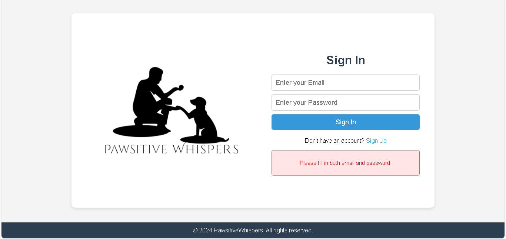
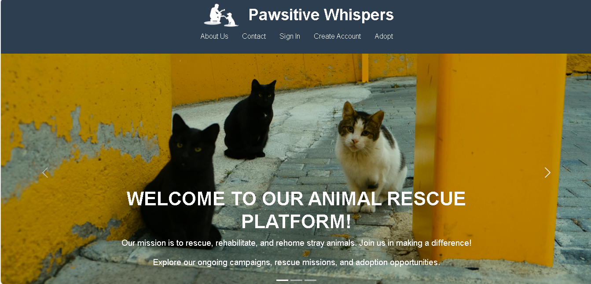
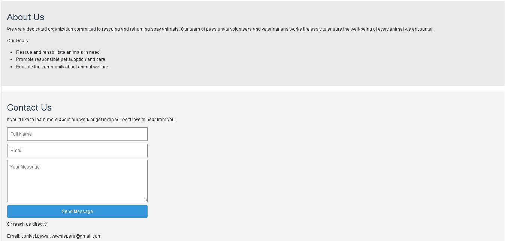
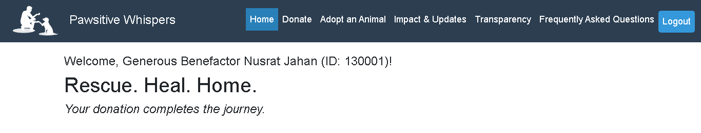
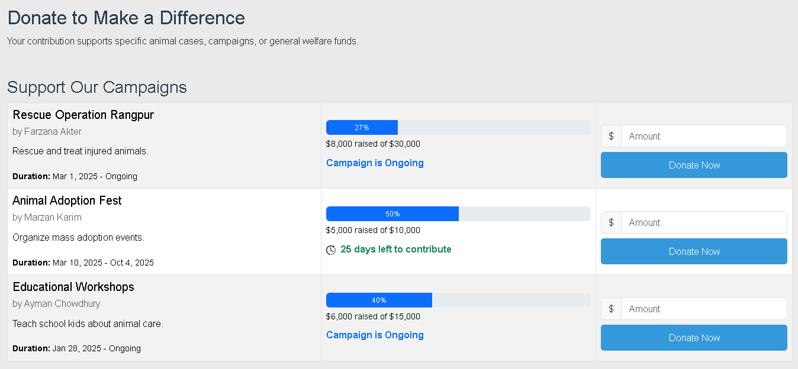
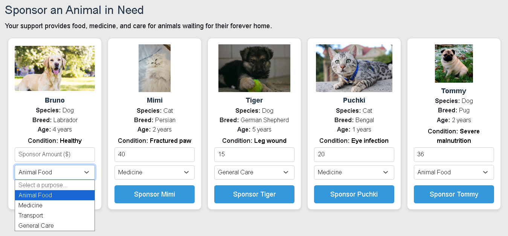
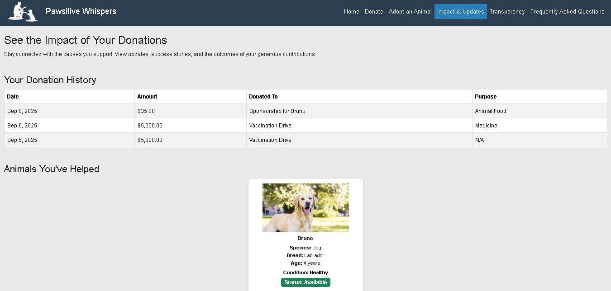
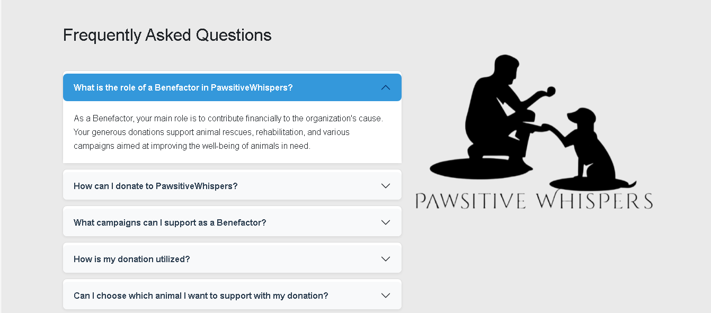

# Pawsitive Whispers
An animal care platform that connects injured animals with vets, volunteers, and adopters. It features AI-powered injury diagnostics, real-time tracking, donation management, and an adoption network, all built with a modular, scalable architecture.

<!--

-->

## License
This project is **© 2024 Pawsitive Whispers. All rights reserved.**  
It is shared publicly for learning and viewing purposes only.  
**Unauthorized copying, modification, distribution, or commercial use is strictly prohibited.**
